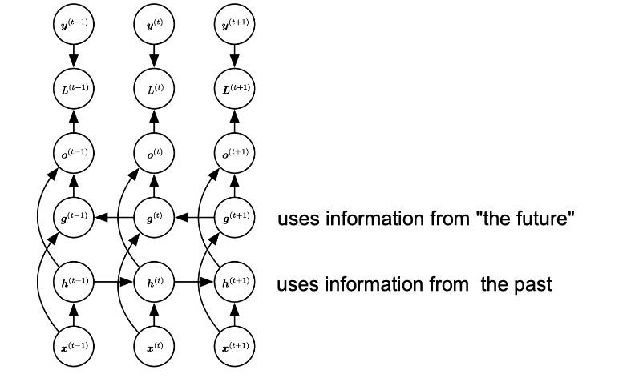

# NLP

## RNN(Recurrent Neural Networks)

### What are Dynamical Systems?

I know the state of the system now at time t.What will be the state at time t+n?

### RNN 

**Back Propagation Through Time(BPTT) Problem** : speed,storage

**Equal sized input and output sequence**

There's **a problem** with back propagation through time at every time step we need to perform back propagation so deep layers have significantly larger computation costs they take longer and activations need to be stored at every time step so the amount of storage you need. 

To avoid training with back propagation through time, we use an algorithm called **teacher forcing**,  so during training time instead of feeding the hidden layer of the previous state to the hidden layer of the next state we feed the output Y the actual label Y from the previous state to the Hidden layer of the next state. 

#### BLEU-Score

对机器生成的翻译进行一个打分来衡量机器翻译的好坏。取值范围为[0,1],越接近1说明翻译质量越好。

#### Teacher Forcing

Teacher Forcing 是一种用于序列生成任务的训练技巧，与Autoregressive模式相对应，这里阐述下两者的区别：

- Autoregressive 模式下，在 timesteps $t$ decoder模块的输入是 timesteps $t-1$ 的输出 $y_{t-1}$ 。这时候我们称 $y_{t-1}$ 为当前预测步的 context;   

- Teacher-Forcing 模式下，在 timestep $t$ decoder模块的输入是 Ground-truth 语句中位置的 $y^*_{t-1}$ 单词。这时候我们称 $y^*_{t-1}$ 为当前预测步的 context；

Teacher-Forcing 技术之所以作为一种有用的训练技巧，主要是因为：

- Teacher-Forcing 能够在训练的时候矫正模型的预测，避免在序列生成的过程中误差进一步放大。

- Teacher-Forcing 能够极大的加快模型的收敛速度，令模型训练过程更加快&平稳。

- Teacher-Forcing 技术是保证 Transformer 模型能够在训练过程中完全并行计算所有token的关键技术。

>如果要用比较不太严谨的比喻来说，Teacher-Forcing 技术相当于就是小明学习的时候旁边坐了一位学霸，当发现小明在做序列生成题目的时候， 每一步都把上一步的正确答案给他偷看。那么小明当然只需要顺着上一步的答案的思路，计算出这一步的结果就行了。这种做法，比起自己每一步都瞎猜， 当然能够有效的避免误差进一步放大，同时在学习前期还能通过学霸辅导的这种方式快速学到很多的知识。

Teacher Forcing 最常见的问题就是 Exposure Bias 了。在严肃开始介绍这个问题的时候，我们继续下上面不太严谨的比喻：

>由于小明平常的学习都是由超级学霸指导下完成的。但是在真正考试的时候，这种情况平常根本没出现过。。没有了超级学霸在旁边，心态容易崩，答案写起来起来也感觉容易崩，才发现自己原来一直学习在学霸的阴影下，从没真正的学习过自己的错误。。。

上面的『比喻』，其实就是不太严谨的 Exposure Bias 现象了。更严谨的表述，由于训练和预测的时候decode行为的不一致， 导致预测单词（predict words）在训练和预测的时候是 **从不同的分布** 中推断出来的。而这种不一致导致训练模型和预测模型直接的Gap，就叫做 Exposure Bias。

除了常见的 Exposure Bias 问题之外，ACL2019 最佳paper中还指出好几个存在的问题：

- Teacher-Forcing 技术在解码的时候生成的字符都受到了 Ground-Truth 的约束，希望模型生成的结果都必须和参考句一一对应。这种约束在训练过程中减少模型发散，加快收敛速度。但是一方面也扼杀了翻译多样性的可能。

- Teacher-Forcing 技术在这种约束下，还会导致一种叫做 **Overcorrect(矫枉过正)** 的问题。例如：

>1. 待生成句的Reference为: "We should comply with the rule."
>2. 模型在解码阶段中途预测出来："We should abide"
>3. 然而Teacher-forcing技术把第三个ground-truth "comply" 作为第四步的输入。那么模型根据以往学习的pattern，有可能在第四步预测到的是 "comply with"
>4. 模型最终的生成变成了 "We should abide with"
>5. 事实上，"abide with" 用法是不正确的，但是由于ground-truth "comply" 的干扰，模型处于矫枉过正的状态，生成了不通顺的语句。     

### Bi-directional RNN

Application: Language Translation, Text Summarization

Input sequence length=output sequence length

### LSTM

**Isn't Vanish/Exploding gradient a problem in DNN too?**

Much worse in RNN than DNN

**How deal with this in RNN? lstm**

LSTM是特殊的RNN,主要为了解决长序列训练过程中梯度消失和梯度爆炸问题。简单来说，相比普通的RNN，LSTM能够在更长的序列中有更好的表现。

左图为普通RNN，右图为LSTM

### Sequence-to-Sequence

The seq2seq model,it aims to transform an input sequence (source) to a new one (target) and both sequences can be of arbitrary lengths. The seq2seq model normally has an encoder-decoder architecture, composed of:

- An **encoder** processes the input sequence and compresses the information into a context vector (also known as sentence embedding or "thought" vector) of a fixed length. This representation is expected to be a good summary of the meaning of the whole source sequence.

- A **decoder** is initialized with the context vector to emit(发射发散) the transformed output. The early work only used the last state of the encoder network as the decoder initial state.Both the encoder and decoder are RNN, i.e. using LSTM or GRU units.

**Unequal sized input and output sequence**

**Encoder**将输入的句子(a sequence of vectors)编码成一个固定长度的向量。如果使用RNN作为Encoder的话 
$$ h_t=f(x_t,h_{t-1})$$
$$ c=q({h_1,...,h_{T_x}})$$

$h_t$是t时刻的hidden state, $c$ 是hidden states的序列产生的context vector, $f$ 和 $q$ 是一些非线性函数，例如 $f$ 使用LSTM, $c$ 取最后一层 hidden state $q({h_1,...,h_{T_x}})=h_T $.

**Decoder** 根据上下文vector $c$ 和之前所预测的单词 ${y_1,...,y_{T_{t'}}}$ 来预测下一个单词 $y_{t'}$. 整个序列的概率如下：   
$$ p(Y)=\prod_{t=1}^{T}p(y_t|\{y_1,...,y_{t-1}\},c)$$

其中 $Y=(y_1,...,y_{T_y})$ .如果使用RNN作为Decoder,当前的输出单词 $y_t$ 的条件概率表示为：
$$ p(y_t|\{y_1,...,y_{t-1}\},c)=g(y_{t-1},s_t,c)$$
其中 $g$ 是非线性函数，$y_{t-1}$ 是上一个单词，$s_t$ 是RNN当前的hidden state, $c$ 是context vector.

**Potential problem:information bottleneck**

The encoder-decoder approach is that a neural network needs to be able to compress all the necessary information of a source sentence into a fixed-length vector.A critical and apparent disadvantage of this fixed-length context vector design is incapability of remembering long sentences. Often it has forgotten the first part once it completes processing the whole input.  Paper showed that the performance of a basic encoder-decoder deteriorates(恶化) rapidly as the length of an input sentence increases.

### LSTM

**Isn't Vanish/Exploding gradient a problem in DNN too?**

Much worse in RNN than DNN

**How deal with this in RNN?** lstm

Three Gates of LSTM Cell:

Input Gate:   Is Cell Updated?   

$$ i^{(t)}=\sigma (W^i[h^{(t-1)},x^{(t)}]+b^i)$$
$$ \bar{C}^{(t)}=tanh(W^C[h^{(t-1)},x^{(t)}]+b^C)$$

Output Gate: Is current info visible? 

$$ o^{(t)}=\sigma(W^o[h^{(t-1)},x^{t}]+b^o)$$            
Forget Gate:  Is memory set to 0?                                                

$$ f^{(t)}=\sigma(W^f[h^{(t-1)},x^{(t)}]+b^f)$$
$$ C^{(t)}=f^{(t)}C^{(t-1)}+i^{(t)}\bar{C}^{(t)}$$
$$ h^{(t)}=tanh(C^{(t)}) \times o^{(t)}$$

They all have sigmoid activation. **Why?**

They constitute smooth curves in the range 0 to 1 and the model remains differentiable.

LSTM Parameters: $b^i,W^i,b^f,W^f,b^c,W^C,b^o,W^o$

### GRU

### Attention Mechanism

The attention mechanism was born to help memorize long source sentences in NMT. Rather than building a single context vector out of the encoder’s **last hidden state** , the secret sauce invented by attention is to create shortcuts between the context vector and the entire source input. The weights of these shortcut connections are customizable(定制) for each output element.

While the context vector has access to the entire input sequence, we don’t need to worry about forgetting. The **alignment** between the source and target is learned and controlled by the context vector. Essentially the context vector consumes three pieces of information:

- encoder hidden states;

- decoder hidden states;

- alignment between source and target.

**Encoder**:Bi-directional RNN for annotation sequences

**Why Bi-directional RNN ?**

we would like the annotation of each word to summarize not only the preceding words, but also the following words. 将前向和后向的hidden state拼接得到每个单词 $x_j$ 的annotation $h_j$ ,$h_j=[\overrightarrow{h_j^T};\overleftarrow{h_j^T}]^T$ 

**Decoder**

定义每一个输出的预测单词 $y_i$ 的条件概率分布为
$$ p(y_i|\{y_1,...,y_{i-1}\},x)=g(y_{i-1},s_i,c_i)$$
其中 $g$ 是非线性函数，$y_{i-1}$ 是上一个单词，$s_i$ 是RNN当前的hidden state, $c_i$ 是当前的context vector.

那么 $c_i$ 是怎么计算得来的呢？目前常用的两种方法BahdanauAttention和LuongAttention.

### Bahdanau Attention
https://arxiv.org/pdf/1409.0473.pdf

The first type of Attention commonly refered to as Additive(加法) Attention.     

The entire step-by-step process of applying Attention in Bahdanau’s paper is as follows:

#### 1.Producing the Encoder Hidden States

We have a source sequence $X$ of length $n$ and try to output a target sequence $Y$ of length $m$:
$$ X=[x_1,x_2,...,x_n]$$
$$ Y=[y_1,y_2,...,y_m]$$

将前向和后向的 hidden state 拼接得到每个单词 $x_j$ 的 annotation $h_j$, $h_j=[\overrightarrow{h_j^T};\overleftarrow{h_j^T}]^T$, $j=1,\cdots,n$ 

#### 2.Calculationg Alignment Scores

After obtaining all of our encoder outputs, we can start using the decoder to produce outputs. At each time step of the decoder, we have to calculate the alignment score of each encoder output with respect to the decoder input and hidden state at that time step. The alignment score is the essence of the Attention mechanism, as it quantifies the amount of "Attention" the decoder will place on(放置) each of the encoder outputs when producing the next output.

The alignment model assigns a score $\alpha_{t,i}$ to the pair of input at position $i$ and output at position $t$, $(y_t, x_i)$, based on how well they match. The set of $\alpha_{t,i}$ are weights defining how much of each source hidden state should be considered for each output. In Bahdanau’s paper, the alignment score $\alpha$ is parametrized by a feed-forward network with a single hidden layer and this network is jointly trained with other parts of the model. The score function is therefore in the following form, given that tanh is used as the non-linear activation function:

$$score(s_t,h_i)=v_a^Ttanh(W_a[s_t;h_i])$$

where both $v_a$ and  are weight matrices to be learned in the alignment model.                 

     

*Note: As there is no previous hidden state or output for the first decoder step, the last encoder hidden state and a Start Of String (<SOS>) token can be used to replace these two, respectively.*

#### 3.Softmaxing the Alignment Scores

After generating the alignment scores vector in the previous step, we can then apply a softmax on this vector to obtain the attention weights. The softmax function will cause the values in the vector to sum up to 1 and each individual value will lie between 0 and 1, therefore representing the weightage each input holds at that time step.         
 

$$a_{ti}=align(y_t,x_i)=\frac{exp(score(s_{t-1},h_i))}{\sum_{i'=1}^{n} exp(score(s_{t-1},h_{i'}))}$$

how well $y_t$ and $x_i$ are aligned

#### 4.Calculating the Context Vector

Now we can generate the context vector by doing an element-wise multiplication of the attention weights with the encoder outputs.
其中 $c_i$ 取决于encoder map the input sequence 的 annotations $(h_1,...,h_{T_x})$,由 annotation vector 加权得到 $c_t=\sum_{i=1}^{n}\alpha_{t,i}h_i$; context vector for output $y_t$

#### 5.Decoding the Output

The context vector we produced will then be concatenated with the previous decoder output. It is then fed into the decoder RNN cell to produce a new hidden state and the process repeats itself from step 2. The final output for the time step is obtained by passing the new hidden state through a Linear layer, which acts as a classifier to give the probability scores of the next predicted word.

### Luong Attention

https://arxiv.org/pdf/1508.04025.pdf

#### 1.Producing the Encoder Hidden States

Just as in Bahdanau Attention, the encoder produces a hidden state for each element in the input sequence.

#### 2.Decoder RNN

Unlike in Bahdanau Attention, the decoder in Luong Attention uses the RNN in the first step of the decoding process rather than the last. The RNN will take the hidden state produced in the previous time step and the word embedding of the final output from the previous time step to produce a new hidden state which will be used in the subsequent steps.

#### 3.Calculating Alignment Scores

In Luong Attention, there are three different ways that the alignment scoring function is defined- dot, general and concat. These scoring functions make use of the encoder outputs and the decoder hidden state produced in the previous step to calculate the alignment scores.

* Dot $score_{\text{alignment}}=H_{
    \text{encoder}}\cdot H_{\text{decoder}}$                                         

* General  $score_{\text{alignment}}=W(H_{
    \text{encoder}}\cdot H_{\text{decoder}})$                                            
    
* Concat $score_{\text{alignment}}=W\cdot \text{tanh}(W_{\text{combined}}(H_{
    \text{encoder}}\cdot H_{\text{decoder}}))$

#### 4.Softmaxing the Alignment Scores

Similar to Bahdanau Attention, the alignment scores are softmaxed so that the weights will be between 0 to 1.

#### 5.Calculating the Context Vector

Again, this step is the same as the one in Bahdanau Attention where the attention weights are multiplied with the encoder outputs.

#### 6.Producting the Final Output

In the last step, the context vector we just produced is concatenated with the decoder hidden state we generated in step 2. This combined vector is then passed through a Linear layer which acts as a classifier for us to obtain the probability scores of the next predicted word.

### A Family of Attention Mechanisms

https://arxiv.org/pdf/1506.07503.pdf

The output  is a sequence of phonemes, and the input $x=(x_1,...,x_{L^{'}})$ is a sequence of feature vectors. $x$ is often processed by encoder(BiRNN) which outputs a sequential input representation $h=(h_1,...,h_{L})$ more suitable for the attention mechanism to work with.  Each feature vector is extracted from a small overlapping window of audio frame. 我们将 Attention mechanism 分成三种根据不同的 score 函数可以分为不同的attention mechanism

#### 1.content-based attention

$$e_{ij}=score(s_{i-1},h_j)=v_a^Ttanh(Ws_{i-1}+Uh_j)$$

$s_{i-1}$: 上一个时间步的解码器输出(解码器隐状态 decoder hidden states)，$h_j$ 是编码器此刻输入(编码器隐状态 encoder hidden states j)，$v_a$、$W$ 和 $U$ 是待训练参数张量。

**The issue of similar speech fragments**

this main limitation is the identical(相等) or similar elements of $h$ are scored equally 而没有考虑他们处于不同的位置. This issue is partially alleviated by an encoder such as e.g. a BiRNN or a deep convolutional network that encode contextual information into every element of $h$. However, capacity of $h$ elements is always limited, and thus disambiguation(消除歧义) by context(上下文) is only possible to a limited extent.

**2.location-based attention**

$$e_{ij}=score(\alpha_{i-1},h_j)=v_a^Ttanh(W_ah_j+U_af_{i,j})$$

$f_{i,j}$ 是之前注意力权重 $\alpha_{i-1}$ 经卷积得到的位置特征，$f_i=F * \alpha_{i-1}$，$v_a$、$W$ 和 $U$ 是待训练参数张量。

Problem:

This  attention mechanism would have to predict the distance between consequent phonemes using  only, which we expect to be hard due to large variance of this quantity.

#### 3.hybrid attention

$$e_{ij}=score(s_{i-1},\alpha_{i-1},h_j)=v_a^Ttanh(Ws_{i-1}+Vh_j+Uf_{i,j}+b)$$

$s_{i-1}$: 上一个时间步的解码器输出(解码器隐状态 decoder hidden states)，$\alpha_{i-1}$ 是之前的注意力权重，$h_j$ 是第 $j$ 个编码器此刻输入(编码器隐状态 encoder hidden states j)，为其添加偏置值 $b$，$v_a$、$W$、$U$ 和 $b$ 是待训练参数张量，$f_{i,j}$ 是之前注意力权重 $\alpha_{i-1}$ 经卷积得到的位置特征，$f_i=F * \alpha_{i-1}$，hybrid attention 同时考虑了内容和输入元素的位置

#### 4.location sensitive attention

$$e_{ij}=score(s_{i},c\alpha_{i-1},h_j)=v_a^Ttanh(Ws_{i}+Vh_j+Uf_{i,j}+b)$$

$s_i$:当前解码器输出(解码器隐状态 decoder hidden states)，$h_j$ 是第 $j$ 个编码器此刻输入(编码器隐状态 encoder hidden states j)，$f_i$ 使用累加注意力权重 $c\alpha_i$ 卷积而来，$f_i=F*c\alpha_{i-1},c\alpha_i=\sum_{j=1}^{i-1}\alpha_j$

### Score Normalization : Sharpening and Smoothing

在每一步用attention机制筛选输入特征时可能会遇到两个情况。一方面，如果输入的序列长度很大，存在很多噪声，筛选信息时可能会引入许多不相关的特征，我们希望让attention更加集中；另一方面，有时我们又希望attention比较平滑(输入序列长度较小)，而计算attention系数用的是softmax函数，很可能让attention集中在几帧特征上。基于以上两种不同的情况，我们分别提出让attention更加集中(Sharpening)或更加平滑(Smoothing)的方法。

$\alpha_{i,j}$ 的其他实现方式 

There are three potential issues with the normalization in Eq. (6). 

1. when $h$ is long, $g_i$ is likely to contain noisy information from many irrelevant feature vectors $h_j$ , as $\alpha_{i,j} > 0,\sum\alpha_{i,j}=1$ . This makes it difficult for the proposed ARSG to focus clearly on a few relevant frames at each time $i$. 

2. The attention mechanism is required to consider all the $L$ frames each time it decodes a single output $y_i$ while decoding the output of length $T$ , leading to a computational complexity of $O(LT)$. This is too expensive when input utterances are long. This issue is less serious for machine translation, because in that case the input sequence is made of words, not of 20ms acoustic frames. 

3. The use of softmax normalization in Eq. (6) prefers to mostly focus on only a single feature vector $h_j$ . This prevents the model from aggregating multiple top-scored frames to form a glimpse $g$.

### Stepwise Monotonic Attention

stepwise monotonic attention使语音合成系统更加鲁棒。

seq2seq的模型的语音合成系统为当今的主流模式，其attention模块决定了输入和输出的对齐质量，从而影响合成的语音好坏，尤其存在 skipping,repeating and attention collapse 的问题。

本文提出了一个好的 attention 评价标准有三个：

（1）locality:输出的帧都能映射到相应的输入；          
（2）monotonicity:单调性;            
（3) completeness:完整性，每个输入都有相应的输出。       

现在的提出的 attention 的在第一点和第2点上进行设计，但没有文章在第三点上进行设计。本文设计了满足以上三个条件的attention，使语音合成系统更加鲁棒。

#### 详细设计

先看一下常用的attention的计算公式1，2，3。先求出上一帧decoder的隐状态和输入的energy，然后使用softmax求取aligment，最后求取context vector c，该方案不具有单调性，因此设计的monotonic attention。

$$e_{i,j}=\text{Attention}(h_{i-1},x_j) \tag{1}$$

$$\alpha_{i,j}=\frac{\text{exp}(e_{i,j})}{\sum_{k=1}^n \text{exp}(e_{i,k})} \tag{2}$$

$$c_i = \sum_{j=1}^n \alpha_{i,j} x_j \tag{3}$$

monotonic attention使用以上的公式1之后，直接使用sigmoid进行概率值预测p。最后使用bernoulli判断是否对memory entry进行前移。当然这种方法使用抽样后不能够后向传播，因此训练时候使用类似上边的soft attention，其对齐参数和预测的概率之间的公式转化为5。该attention具有单调性但不能保证满足completeness。

$$p_{i,j}=\sigma(e_{i,j})  \tag{4}$$
$$\alpha_{i,j}=p_{i,j}\Big(\frac{(1-p_{i,j-1})\alpha_{i,j-1}}{p_{i,j-1}}+\alpha_{i-1,j}\Big) \tag{5}$$

本文在monotonic 基础上添加限制：每次memory entry移动只能最多移动一步，则对齐参数和预测的概率之间的公式转化为7。

$$\alpha_{i,j}=\alpha_{i-1,j-1}(1-p_{i,j-1})+\alpha_{i-1,j}p_{ij} \tag{7}$$
$$\alpha_i = \alpha_{i-1}\cdot p_i +[0;\alpha_{i-1,:-1}\cdot(1-p_{i,:-1})] \tag{8}$$

以上attention的更直观的如图1所示，一目了然。

**Sharpening**

针对第一个问题：$\alpha_{i,j}=exp(\beta e_{i,j}) /\sum_{j=1}^{L}exp(\beta e_{i,j})$ 但是他的复杂度依旧为 $O(LT)$. We also propose and investigate a *windowing* technique. At each time i, the attention mechanism considers only a subsequence $\tilde{h}=(h_{p_i-w},...,h_{p_i+w-1})$ of the whole sequence $h$, $p_i$ is the median(中位数) of the alignment $\alpha_{i,j}$. .This windowing technique is similar to taking the top-k frames, and similarly, has the effect of sharpening.

**Smoothing**

$$\alpha_{i,j}=\sigma(e_{i,j})/ \sum_{j=1}^{L} \sigma(e_{i,j})$$

### Self-Attention

Relating different positions of the same input sequence. Theoretically the self-attention can adopt any score functions above, but just replace the target sequence with the same input sequence. The self-attention mechanism enables us to learn the correlation between the current words and the previous part of the sentence.                  Global/Soft & Local/Hard AttentionGlobal/Soft AttentionEssentially the same type of attention as in Bahdanau et al., 2015.Pro: the model is smooth and differentiable.Con: exprensive when the source input is large.                                               Local/Hard AttentionOnly selects one patch of the inputs to attend to at a timePro: less calculation at the inference time.Con: the model is non-differentiable and requires more complicated techniques such as variance reduction or reinforcement learning to train.                                           

### Transformers

LSTM slower than RNN ,input data needs to be passed sequentially or serially one after the other, we need inputs of the previous state to make any operations on the current state. Such sequential flow doesn't make use of today's GPUs very well which are designed for parallel computation. **So how can we use parallelization for sequential data?**

Transformer neural network architecture was introduced the network employs an encoder decoder architecture. The difference from RNN is the input sequence can be passed in parallel.

word embedding are generated one time&emsp;&emsp;&emsp;&emsp;&emsp;&emsp;&emsp;&emsp;&emsp;&emsp;there is no concept of time step for the input.

step at a time   &emsp;&emsp;&emsp;&emsp;&emsp;&emsp;&emsp;&emsp;&emsp;&emsp;&emsp;&emsp;&emsp;&emsp;&emsp;&emsp;&emsp;&emsp;we pass in all the words of the sentence simultaneously 

&emsp;&emsp;&emsp;&emsp;&emsp;&emsp;&emsp;&emsp;&emsp;&emsp;&emsp;&emsp;&emsp;&emsp;&emsp;&emsp;&emsp;&emsp;&emsp;&emsp;&emsp;&emsp;&emsp;&emsp;&emsp;&emsp;and determine the word embeddings simultaneously

#### Transformer Components

**Encoder block**

**1.Input embedding--vectors and matrices**

The idea is to map every word to a point in space where similar words in meaning are physically closer to each other. The space in which they are present is called an embedding space. We can train this embedding space to save time or even just use an already pre-trained embedding space.

**2.Positional Encoder** 

Embedding space maps a word to a vector but the same word in different sentences may have different meanings this is where positional encoders come in. It's a vector that has information on distances between words and the sentence. 

**3.Attention**

What part of the input should we focus?

Attention vectors are computed in the attention block for every word. We can have an attention vector generated which captures contextual relationships between words in the sentence.

Attention block computes the attention vectors for each word only have a problem here is that the attention vector may not be too strong for every word, the attention vector may weight its relation with itself much higher. It's true but it's useless we are more interested in interactions with different words and so we determine like eight such attention vectors per word and take a weighted average to compute the final attention vector for every word. We call it the **multi-head attention**.

averaged vectors

The attention vectors are passed in through a feed-forward net one vector at a time. The cool thing is that each of the attention nets are independent of each other so we can use parallization here.

**Decoder block**

Encode-Decode Attention

Masked attention block